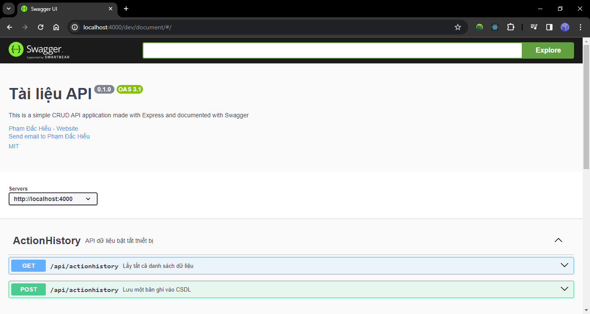

# IOT Project

## 1. Tổng quan

Dự án web app IoT sử dụng mạch Esp8266 để quản lý nhiệt độ, độ ẩm, ánh sáng cùng một số chức năng bật/tắt đèn và quạt.

Các chức năng chính:

- **Hiển thị dữ liệu từ hardware**: Tất cả các dự liệu từ `hardware` sẽ được chuyển đến `server (NodeJS)` thông qua `MQTT broker` để xử lý sau đó sẽ lưu lại vào `database (Sql sever)`. Xong, `server` sẽ cung cấp các `api` để cho `client(ReactJS)` hiển thị.
- **Bật/tắt đèn, quạt**: `Người dùng` sẽ thực hiện hành động bật đèn trên `client` sau đó `client` sẽ gọi đến `websocket` bên `server`. `Server` sẽ kết nối `MQTT broker` để thực hiện hành động bật đèn và trả về dự liệu cho `server`. `Server` trả dữ liệu cho client để client hiển thị.

## 2. Cách cài đặt dự án

### Bước 1: Clone dự án ở repo

Lấy source code từ trên github về máy.

```
git clone https://github.com/dachieu2k2/IoT.git
```

### Bước 2: Cài node_modules

Tải tất cả các package cần thiết để chạy các dự án node js.

```
Chạy file install_run.bat
```

### Bước 3: Thêm `.env` vào dự án

Vào folders `server/` tạo file `.env` đây là file để hết tất cả các biến môi trường.

VD:

```JS
HOST = localhost
USER = root
PASSWORD =
DB = IoT
```

### Bước 4: Chạy dự án

```
chạy file dev_run.bat
```

> Yêu cầu: Tất cả phải có thiết bị hardware `ESP8266`, `dht11`, `2 LED`, `quang trở`, ` dây nạp code USB mini, type A-micro`, `một số dây để nối vào nguồn`

- Tất cả source code của hardware đều được ở trong folder `hardware`

### Dự án sau khi chạy

Truy cập vào API `http://localhost:4000/dev/document/#/` để xem document của Server



## 3. Tài liệu và tham khảo

- Cài node js tại: [Nodejs](https://nodejs.org/en).
- Cài đặt arduino tại: [Arduino](https://www.arduino.cc/en/software)
- Cài đặt Mqtt tại: [Mosquitto](https://mosquitto.org/download/)
- Kiến thức về hardware: [From Zero to Smart Home Hero: Automate Your Life with NodeMCU and MQTT](https://youtu.be/qdxKUQEgDNE?si=jq4B2je0GqNbf6Yp)
- Cách MQTT broker: [Cài đặt Local MQTT Broker trên Windows #1](https://www.youtube.com/watch?v=xLLFrLhegcw)
- Bảo mật MQTT brokder với username, password: [Setting up User name and password for Mosquitto Mqtt Broker](https://www.youtube.com/watch?v=fknowuQJ9MA).
-
